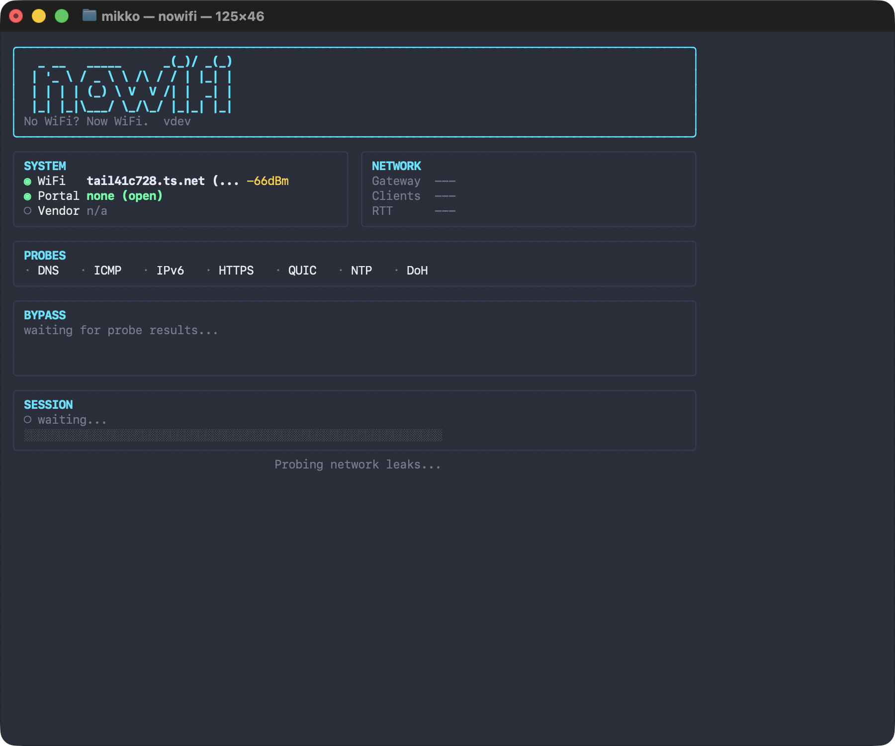

# nowifi

[](LICENSE)
[](https://github.com/MikkoParkkola/nowifi/actions/workflows/ci.yml)
[](https://goreportcard.com/report/github.com/MikkoParkkola/nowifi)
[](https://github.com/MikkoParkkola/nowifi/releases)
[](https://github.com/MikkoParkkola/nowifi/releases)
[](go/go.mod)
[](https://libraries.io/github/MikkoParkkola/nowifi)
[](https://github.com/MikkoParkkola/nowifi)

### No WiFi? Now WiFi.

**Author: Mikko Parkkola**

One command. 43 techniques. Browser works immediately.

```bash
sudo nowifi
```

<p align="center">
  
</p>

Stuck behind a hotel/airport/cafe WiFi login page? `nowifi` detects the captive portal, probes for weaknesses, and tries 35 bypass techniques automatically -- most powerful first, stops on the first one that works. Your browser works immediately. `Ctrl+C` restores everything.

Need the actual WiFi password instead? `nowifi crack` runs an ordered 8-technique WPA/WPA2 cracking pipeline. It escalates from PMKID and WPS Pixie-Dust through handshake capture, dictionary/smart cracking, and only then to WPS PIN or online brute force, stopping as soon as a password is recovered.

---

## Installation

### Homebrew (Recommended)

```bash
brew install MikkoParkkola/tap/nowifi
```

That's it. Pre-built binary, no Go toolchain, no `sudo install`. Works on
Apple Silicon, Intel Macs, Linux x86_64, and Linux arm64.

### Pre-built Binaries (Manual)

Download the latest release for your platform from
[GitHub Releases](https://github.com/MikkoParkkola/nowifi/releases/latest)
and verify checksums against
[`checksums.sha256`](https://github.com/MikkoParkkola/nowifi/releases/latest/download/checksums.sha256).
Release assets also include CycloneDX SBOMs, Sigstore keyless signatures
(`.sigstore.json` bundles), and GitHub provenance attestations.

```bash
# macOS Apple Silicon
curl -LO https://github.com/MikkoParkkola/nowifi/releases/latest/download/nowifi-darwin-arm64.tar.gz
curl -LO https://github.com/MikkoParkkola/nowifi/releases/latest/download/checksums.sha256
shasum -a 256 -c checksums.sha256 --ignore-missing
tar xzf nowifi-darwin-arm64.tar.gz
sudo install -m 0755 nowifi-darwin-arm64 /usr/local/bin/nowifi

# macOS Intel
curl -LO https://github.com/MikkoParkkola/nowifi/releases/latest/download/nowifi-darwin-amd64.tar.gz
curl -LO https://github.com/MikkoParkkola/nowifi/releases/latest/download/checksums.sha256
shasum -a 256 -c checksums.sha256 --ignore-missing
tar xzf nowifi-darwin-amd64.tar.gz
sudo install -m 0755 nowifi-darwin-amd64 /usr/local/bin/nowifi

# Linux x86_64
curl -LO https://github.com/MikkoParkkola/nowifi/releases/latest/download/nowifi-linux-amd64.tar.gz
curl -LO https://github.com/MikkoParkkola/nowifi/releases/latest/download/checksums.sha256
sha256sum -c checksums.sha256 --ignore-missing
tar xzf nowifi-linux-amd64.tar.gz
sudo install -m 0755 nowifi-linux-amd64 /usr/local/bin/nowifi

# Linux ARM64
curl -LO https://github.com/MikkoParkkola/nowifi/releases/latest/download/nowifi-linux-arm64.tar.gz
curl -LO https://github.com/MikkoParkkola/nowifi/releases/latest/download/checksums.sha256
sha256sum -c checksums.sha256 --ignore-missing
tar xzf nowifi-linux-arm64.tar.gz
sudo install -m 0755 nowifi-linux-arm64 /usr/local/bin/nowifi
```

### Build from Source

```bash
git clone https://github.com/MikkoParkkola/nowifi.git
cd nowifi/go
make build
make test-short
make ci
sudo install -m 0755 bin/nowifi /usr/local/bin/nowifi  # optional
```

Requires Go 1.26+. The macOS menubar (`nowifi menubar`) requires CGO and is
only included in native macOS builds.

---

## Quick Start

```bash
# One command. Detect, bypass, cloak, and stay connected until you stop.
sudo nowifi

# Read-only assessment (no changes to network)
nowifi diagnose

# Capture a forensic package when an environment can't be bypassed (read-only)
nowifi forensics

# WPA password cracking
sudo nowifi crack

# Check system health
nowifi doctor
```

`sudo nowifi` does everything automatically: detects the portal, probes for leaks, bypasses using the most powerful technique available, applies traffic stealth (anti-tethering), and **maintains your connection** until you press `Ctrl+C`. All network changes are restored on exit.

---

## Key Features

- **Session persistence** — stays connected after bypass. Auto-renews on session expiry (MAC rotate → full re-bypass → re-probe). One command at boarding, connected for the entire flight.
- **Traffic stealth** — TTL normalization to defeat anti-tethering detection (macOS also adds IP ID randomization and MSS clamping via PF). Your bypassed connection looks identical to a directly-connected device.
- **Inflight WiFi intelligence** — profiles for 7 major providers (Panasonic, Gogo, Viasat, Inmarsat, Thales, SITA, Anuvu) covering 40+ airlines. Auto-detects provider and optimizes technique ordering.
- **Satellite-aware** — detects high-latency links (RTT > 400ms) and adjusts all timeouts dynamically. Prevents false-positive idle detection on inflight networks.
- **Zero-config tunnels** — auto-deploys Cloudflare Workers proxy if no tunnel server is configured. Checksum-verifies and auto-downloads `cloudflared` for DoH tunneling.
- **Clean restore guarantee** — `Ctrl+C` always restores original MAC, proxy, DNS, TTL, PF rules, and tunnel processes. Handles SIGINT/SIGTERM via signal handlers and any clean exit via `defer`.

---

## Common Commands and Examples

| Command | What it does |
|---------|-------------|
| `sudo nowifi` | Full audit: detect, probe, bypass, maintain access, restore on exit |
| `sudo nowifi -p` | Probe only -- find leaks without exploiting them |
| `sudo nowifi --dry-run` | Read-only audit plan: detect, probe, and show feasible bypasses without mutating state |
| `sudo nowifi --fast` | Skip stealth timing (faster but more detectable) |
| `sudo nowifi -t URL` | Use a specific chisel tunnel server |
| `sudo nowifi --http3-server https://vps:443` | HTTP/3-ALPN tunnel to nowifi server (#22) |
| `sudo nowifi --doq-server 1.1.1.1:853` | Override default DoQ resolver (#21) |
| `sudo nowifi --ech-server https://... --ech-config-list <b64>` | TLS 1.3 ECH domain fronting (#24) |
| `sudo nowifi --masque-server https://proxy:443` | MASQUE tunnel via HTTP/3 Extended CONNECT (#27) |
| `sudo nowifi --wt-server https://proxy:443/wt` | WebTransport tunnel over HTTP/3 (#28) |
| `sudo nowifi --h2-proxy https://proxy:443` | HTTP/2 CONNECT tunnel (gRPC-style) (#29) |
| `sudo nowifi --sse-server https://relay.example.com` | SSE streaming tunnel (#30) |
| `sudo nowifi --grpc-server https://proxy:443` | gRPC bidi streaming tunnel (#31) |
| `sudo nowifi --connectip-server https://proxy:443` | CONNECT-IP full IP tunnel (#32) |
| `sudo nowifi -i en1` | Use a different WiFi interface (default: `en0`) |
| `nowifi recon -o klm.json` | Passive network fingerprint for contributing provider profiles |
| `nowifi diagnose` | Read-only security assessment (no changes to network) |
| `nowifi diagnose -r json -o report.json` | Save diagnosis as JSON file |
| `nowifi forensics` | Capture a portable forensic package of which channels survive enforcement (read-only, no sudo, local-only `holes-<ts>.{txt,json}`) |
| `nowifi forensics --baseline` | Capture a full-access baseline to diff against later under enforcement |
| `nowifi report` | Review and submit queued reports from networks nowifi couldn't bypass (consent-gated GitHub issue, MACs redacted) |
| `nowifi crack` | 8-technique WPA/WPA2 cracking pipeline (ordered fastest-to-slowest, stops on first recovered password) |
| `nowifi crack --scan-only` | Scan for WiFi networks without attacking |
| `nowifi scan` | Scan nearby WiFi networks with signal/security info |
| `nowifi watch` | Maintain access -- auto-reconnect on session expiry |
| `nowifi history` | Show past audit sessions |
| `nowifi tools` | Show which external tools are installed/missing |
| `nowifi tools -d` | Checksum-verified auto-download of missing tools (chisel, hysteria, cloudflared) |
| `nowifi server create` | Create a tunnel server (CF Worker or VPS) |
| `nowifi server list` | List active tunnel servers |
| `nowifi server rotate-token` | Redeploy the managed Worker with a fresh `nowifi_token` |
| `nowifi server destroy` | Destroy a tunnel server |
| `nowifi server info` | Show which techniques need a server |
| `nowifi config list` | Show saved defaults such as tunnel endpoints and interface |
| `sudo nowifi server listen` | Run the HTTP/3-ALPN tunnel server (peer for `--http3-server`) |
| `nowifi ecosystem` | Show complementary tools (bettercap, wifiphisher, etc.) |
| `nowifi setup` | Interactive first-time setup wizard |
| `nowifi doctor` | System health check |
| `nowifi doctor --json` | Machine-readable health check output |
| `nowifi ui` | Launch the web dashboard |
| `nowifi menubar` | Launch the macOS menubar app |
| `nowifi score` | Grade nearby WiFi networks (A-F) |
| `sudo nowifi reset` | Emergency network reset after crash/kill |

---

## 43 Techniques

### Portal Bypass (35 techniques)

These work when you're connected to WiFi but stuck behind a captive portal login page.

| # | Technique | How it works | Severity |
|---|-----------|-------------|----------|
| 1 | **IPv6 bypass** | Portal only filters IPv4; IPv6 passes unfiltered | Critical |
| 2 | **HTTPS/WS tunnel** | Chisel WebSocket tunnel through HTTPS to your server | Critical |
| 3 | **CNA User-Agent spoof** | Portal auto-approves Apple CNA/Wispr User-Agent requests | High |
| 4 | **JS-only bypass** | Portal enforces auth only in JavaScript, not server-side | High |
| 5 | **HTTP CONNECT abuse** | Tunnel through the portal's transparent proxy via CONNECT | High |
| 6 | **MAC clone (idle)** | Clone an inactive authenticated device's MAC address | Critical |
| 7 | **MAC clone (any)** | Clone any authenticated device's MAC from ARP table | Critical |
| 8 | **DNS tunnel** | IP-over-DNS via iodine (50-500 Kbps) | High |
| 9 | **ICMP tunnel** | IP-over-ping via hans (100-300 Kbps) | High |
| 10 | **VPN on port 53** | WireGuard/OpenVPN on DNS port, usually allowed | High |
| 11 | **Whitelist domain** | Tunnel via whitelisted CDN domain | Medium |
| 12 | **Session cookie replay** | Sniff and replay portal auth cookies (HTTP portals) | High |
| 13 | **Portal default creds** | Try default admin passwords on portal management | Critical |
| 14 | **MAC rotate** | Fresh random MAC for new session/quota/time limit | High |
| 15 | **DHCP rotate** | New IP via DHCP release/renew cycle | Medium |
| 16 | **QUIC tunnel** | Hysteria2 over UDP/443 (looks like HTTP/3 to DPI) | Critical |
| 17 | **CF Workers proxy** | Serverless proxy via Cloudflare Workers (no server needed) | Critical |
| 18 | **NTP tunnel** | Data encoded in NTP extension fields on UDP/123 | High |
| 19 | **DoH tunnel** | DNS-over-HTTPS to Cloudflare/Google (whitelisted endpoints) | High |
| 20 | **CAPPORT extend** | RFC 8908 captive-portal API — surfaces session state and user-portal URL | Medium |
| 21 | **DoQ tunnel** | DNS-over-QUIC (RFC 9250) to public resolver, bypasses DNS interception | High |
| 22 | **HTTP/3 tunnel** | Pure-Go QUIC tunnel with ALPN `h3` on UDP/443, SOCKS5 wrapper | Critical |
| 23 | **DHCP Option 121 route** | CVE-2024-3661 "TunnelVision" — honor DHCP-advertised static routes that bypass the portal's filter chain (serverless) | High |
| 24 | **ECH domain fronting** | TLS 1.3 Encrypted Client Hello (RFC 9147) cloaks the real SNI behind a CDN cover name | Critical |
| 25 | **WG-over-WebSocket** | WireGuard/tunnel payloads in WS binary frames on TCP/443 (looks like Teams/Zoom) | Critical |
| 26 | **Secondary interface** | Use cellular/USB-Ethernet/Bluetooth-PAN to exit the carrier, bypassing portal entirely (serverless) | Critical |
| 27 | **MASQUE tunnel** | HTTP/3 Extended CONNECT (RFC 9220/9298) — identical to Apple Private Relay/Cloudflare WARP | Critical |
| 28 | **WebTransport tunnel** | RFC 9220 WebTransport over HTTP/3 — looks like Google Meet/Zoom to DPI | Critical |
| 29 | **HTTP/2 CONNECT tunnel** | HTTP/2 binary-framed CONNECT — looks like gRPC/Cloud API to DPI | Critical |
| 30 | **SSE streaming tunnel** | Server-Sent Events downlink + HTTP POST uplink — looks like a news feed | High |
| 31 | **gRPC bidi streaming tunnel** | HTTP/2 + application/grpc framing — looks like Kubernetes/microservice API traffic | High |
| 32 | **CONNECT-IP tunnel** | RFC 9484 full IP tunnel via QUIC datagrams — identical to Apple Private Relay | Critical |
| 33 | **Cloudflare WARP tunnel** | Zero-config — auto-registers free WARP device, tunnels via HTTP/2 CONNECT | Critical |
| 34 | **Portal self-relay** | Zero-config — tunnels through portal-whitelisted domains (Stripe, Google, Apple) via HTTP/2 CONNECT | Critical |
| 35 | **TURN relay** | Zero-config — relays through public WebRTC TURN servers on TCP/443, indistinguishable from video calls | High |

### When nowifi can't bypass — the self-improving loop

If every technique fails, nowifi turns the dead end into data. It automatically captures a **forensic package** (which egress channels survived enforcement, the portal's control-plane surface, the ranked candidate techniques) and **queues it locally** — because a failed bypass means you're offline and can't file anything yet.

The next time you run nowifi **with working internet** (or `nowifi watch` reconnects), it asks once:

```
Unsolved network captured 2026-05-29 — provider=panasonic_nordic_sky, 25 open channels.
Submit this report to github.com/MikkoParkkola/nowifi? [y/N]
```

On `y`, it files a GitHub issue containing everything needed to build a bypass for that environment. Nothing is ever uploaded without that explicit consent, and your MAC plus nearby device MACs are redacted to vendor IDs first. Disable with `nowifi config set report_failures false`.

### Anonymous Telemetry (opt-in, zero-cost)

nowifi can send anonymous data about which bypass techniques succeed on which captive portals. Purpose: security research + improved technique ordering in future releases.

```bash
nowifi telemetry enable    # opt in
nowifi telemetry status    # show state
nowifi telemetry disable   # opt out
```

**Collected**: technique ID, success, provider, duration, version, country
**NEVER collected**: IP, MAC, SSID, portal URL, DNS names, or any personal identifier

Data goes to a single Cloudflare Worker running on the free tier (100K events/day). Source: [worker/telemetry/](worker/telemetry/).

### WPA Cracking (4 techniques)

These crack the actual WiFi password when you don't have it. The stages run in order, and slower fallback steps only run if the earlier capture and smart-crack stages fail.

| # | Technique | How it works |
|---|-----------|-------------|
| 31 | **PMKID capture** | Extract PMKID from AP's first message -- no clients needed (~60% of APs) |
| 32 | **WPS Pixie-Dust** | Exploit weak RNG in WPS (~30% of WPS-enabled APs, 5-30s) |
| 33 | **Handshake capture + hashcat** | Deauth a client, capture 4-way handshake, GPU crack |
| 34 | **WPS PIN brute force** | Brute force 11,000 PIN combinations (2-10 hours, last resort) |

### Smart Cracking (4 additional strategies)

| # | Technique | How it works |
|---|-----------|-------------|
| 35 | **Smart common passwords** | Top 1000 WiFi passwords (embedded, no wordlist needed) |
| 36 | **Numeric mask attack** | 8-digit patterns common in ISP-issued routers |
| 37 | **Word+number rules** | Hashcat rules combining dictionary words with numbers |
| 38 | **Online brute force** | wpa_supplicant PSK attempts (no monitor mode needed) |

The smart-crack pipeline also runs dictionary, smart-brute, and (opt-in) full-brute stages between rules and online brute force, in increasing cost order.

---

## External Tools

nowifi works out of the box for many techniques. External tools unlock tunnel and cracking capabilities.

```bash
# Check what's installed
nowifi tools

# Checksum-verified auto-download of supported tools
nowifi tools -d
```

| Tool | Unlocks | Install |
|------|---------|---------|
| chisel | HTTPS/WS tunnel (#2) | `nowifi tools -d` |
| hysteria | QUIC tunnel (#16) | `nowifi tools -d` |
| cloudflared | DoH tunnel (#19) | `nowifi tools -d` |
| iodine | DNS tunnel (#8) | `brew install iodine` |
| hans | ICMP tunnel (#9) | `brew install hans` |
| hashcat | WPA cracking (GPU) | `brew install hashcat` |
| aircrack-ng | WPA cracking (CPU) | `brew install aircrack-ng` |
| hcxdumptool | PMKID/handshake capture | `brew install hcxdumptool` |
| hcxpcapngtool | Convert captures for hashcat | `brew install hcxtools` |
| reaver | WPS Pixie-Dust/PIN attacks | `brew install reaver` |

### Antivirus false positives (chisel, hysteria, cloudflared)

These tools are legitimate FOSS tunneling utilities, but several antivirus engines classify them as **HackTool / PUA** (potentially unwanted application) — not a virus, not a trojan, but a dual-use tool also seen in real attack chains (CISA AA22-216A, AA23-129A flagged chisel use by ransomware groups).

What you may see:

| Engine | Verdict | Severity |
|---|---|---|
| Microsoft Defender | `HackTool:Win64/Chisel`, `HackTool:Linux/Chisel` | informational |
| ESET | `Linux/Chisel.A` (potentially unsafe application) | low |
| Sophos | `HackTool/Chisel-A` | low |
| Kaspersky | `not-a-virus:RemoteAdmin.*` | informational |
| VirusTotal | 15-25 / 70 detections, all "HackTool / PUA" category | — |

**Verification you have the real binaries:**

```bash
# nowifi auto-downloads from official release pages and verifies SHA-256.
# To re-check manually:
shasum -a 256 ~/.nowifi/tools/chisel       # compare to github.com/jpillora/chisel/releases
shasum -a 256 ~/.nowifi/tools/hysteria     # compare to github.com/apernet/hysteria/releases
shasum -a 256 ~/.nowifi/tools/cloudflared  # compare to github.com/cloudflare/cloudflared/releases
```

**If your antivirus quarantines a tool:**

1. Confirm the binary path is under `~/.nowifi/tools/` (auto-downloaded, SHA-verified) — not a random location.
2. Whitelist by SHA-256 in your AV (preferred, narrow exception). Generic path-whitelisting `~/.nowifi/tools/*` is also acceptable.
3. If the SHA-256 does **not** match the upstream release, do **not** whitelist — re-run `nowifi tools -d` to re-download, or report a supply-chain concern in [SECURITY.md](SECURITY.md).

These tools are not malware. They are the same binaries used by network engineers, pentesters, and remote-access tooling worldwide. Treat the AV verdict as informational, not a stop-the-line signal.

---

## Tunnel Server Setup

Many techniques work without any server (MAC clone, IPv6, CNA spoof, etc.). Tunnel-based bypasses need a server you control outside the portal's network.

### Quickest: Cloudflare Workers (Free)

```bash
nowifi server create
# Deploys a free authenticated Cloudflare Worker proxy (100K req/day)
```

The generated Worker URL includes a `nowifi_token` query parameter. Keep that
full URL in your nowifi config; tokenless Worker URLs are rejected to avoid
leaving an open public proxy on your Cloudflare account.

### VPS (DigitalOcean / Hetzner)

```bash
nowifi server create -p digitalocean -t do_xxx_token
# Creates $0.007/hr droplet with chisel+iodine+hans pre-installed
```

### Your Own Server

```bash
# On your server:
chisel server --reverse --port 443

# On your laptop (behind portal):
sudo nowifi -t https://your-server.example.com
```

### HTTP/3-ALPN Tunnel Server (#22, pure-Go, no external binary)

```bash
# On your server (once):
sudo nowifi server listen --addr 0.0.0.0:443 --hostname tunnel.example.com
# Auto-generates a self-signed cert (or pass --cert/--key for Let's Encrypt).

# On your laptop (behind portal):
sudo nowifi --http3-server https://tunnel.example.com:443
```

The server speaks QUIC with ALPN `h3` on UDP/443. From a middlebox's point of view the traffic is indistinguishable from a browser HTTP/3 session, so it passes TCP-only DPI and most captive-portal filters.

### DoH/DoQ (no server needed)

Technique #21 (DoQ) connects to a public resolver (default `dns.adguard.com:853`), so no infrastructure is required. Same for #19 (DoH — Cloudflare/Google).

---

## Recipes

Hands-on guides for specific scenarios:

- [VPN over Cloudflare Quick Tunnel](docs/recipes/vpn-over-quick-tunnel.md) — carry a VPN through a TCP-only captive portal using zero-config UDP (`nowifi server create -p cloudflare-quick --udp`), plus four alternative strategies (chisel-legacy, OpenVPN TCP, wstunnel, Tailscale/ZeroTier).

See [`CHANGELOG.md`](CHANGELOG.md) for the full release history.
Security-sensitive changes should also use the
[`SECURITY.md`](SECURITY.md) policy and
[`docs/SECURITY-REGRESSION-CHECKLIST.md`](docs/SECURITY-REGRESSION-CHECKLIST.md).

---

## Architecture (Go)

```
cmd/nowifi/main.go         Entry point
internal/
  cli/                     Cobra commands (audit, diagnose, crack, tools, ...)
  detect/                  Portal detection: canary URLs, DNS hijack, vendor fingerprinting
  probe/                   Leak enumeration: DNS, ICMP, IPv6, HTTPS, QUIC, NTP, DoH, ports
  bypass/                  35 portal bypass techniques, ordered most-powerful-first
  crack/                   WPA cracking: PMKID, handshake, hashcat, WPS, smart crack
  tunnel/                  Tunnel management: chisel, iodine, hans, hysteria
  platform/                OS abstraction: macOS (darwin.go) / Linux (linux.go)
  report/                  Terminal, markdown, and JSON report generation
  toolchain/               External tool discovery, auto-download, version management
  server/                  Cloudflare Workers + VPS provisioning (DO, Hetzner)
  config/                  Persistent config (~/.nowifi/config.json)
  capture/                 Audit trail storage (~/.nowifi/captures/)
  guard/                   State restoration on exit (MAC, proxy, DNS)
  monitor/                 WiFi monitor mode management
  discover/                WiFi network scanning
  portal/                  Auto-login to known portal types
  clone/                   MAC address cloning
  inflight/                Airline portal intelligence: 7 provider profiles, 40+ airlines
  score/                   WiFi network scoring (A-F grade)
  ui/                      Web dashboard + menubar app
```

---

## Responsible Use

This tool is for **authorized security assessments** of captive portal implementations.

- **Only test networks you own or have explicit written authorization to test.** Unauthorized access to computer networks is illegal in most jurisdictions (e.g., CFAA in the US, Computer Misuse Act in the UK, Rikoslaki 38:8 in Finland).
- **Deauthentication attacks** (technique #22, WPA handshake capture) actively interfere with other users' connections. This may violate telecommunications regulations even on networks you own, if it affects third parties.
- **MAC cloning** another device's address takes over their authenticated session, disconnecting them. Only use this in controlled lab environments or with explicit consent.
- **Session cookie replay** involves capturing other users' network traffic. This may violate wiretapping laws in your jurisdiction.

The authors accept no liability for misuse. This tool is published for defensive research, security assessment, and education.

---

## More Tools

| Tool | What it does |
|------|-------------|
| [trvl](https://github.com/MikkoParkkola/trvl) | AI travel agent — flights, hotels, ferries, 33 MCP tools |
| [axterminator](https://github.com/MikkoParkkola/axterminator) | macOS GUI automation — 30 MCP tools, audio/camera capture |
| [mcp-gateway](https://github.com/MikkoParkkola/mcp-gateway) | Universal MCP gateway — single-port multiplexing |
| [nab](https://github.com/MikkoParkkola/nab) | Token-optimized HTTP client for LLMs |

All tools: `brew tap MikkoParkkola/tap && brew install trvl axterminator mcp-gateway nab nowifi`

## License

[AGPL-3.0](LICENSE) -- Copyright (C) 2026 Mikko Parkkola
